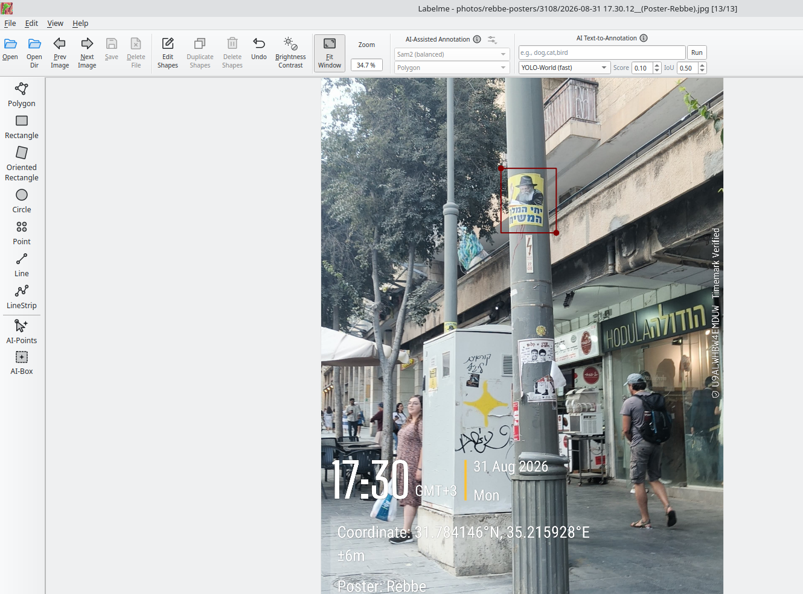

# Annotating posters and building the training dataset

How a batch of photographs becomes a public object-detection dataset. Two
steps: draw boxes in labelme, then run one script.

Verified 2026-09-01 with labelme 7.2.0 (Python 3.13, installed via
`uv tool install labelme`) on Ubuntu/Wayland.

## The chain

```
photos/<project>/<DDMM>/*.jpg
  + posters.csv                       (survey metadata, already built)
  + annotations/labelme/<project>/<DDMM>/*.json   (boxes, drawn by hand)
  -> dataset/                         (Hugging Face imagefolder + YOLO tree)
```

`annotations/labelme/` is source data and is committed. `dataset/` is a build
artifact — it contains *copies* of the photographs — and is git-ignored. The
published copy lives on the Hugging Face Hub; rebuild it, never hand-edit it.

## 1. Draw the boxes

```bash
labelme "photos/rebbe-posters/3108" \
  --labels annotations/labels.txt \
  --output annotations/labelme/rebbe-posters/3108 \
  --validate-label exact
```



*Frame `17.30.12`, one sticker boxed. The Timemark watermark burnt into the
photograph carries the same coordinates that `posters.csv` reads out of EXIF —
useful as a visual cross-check, but the CSV never transcribes them off the
pixels.*

`--output` keeps the JSON out of `photos/`, so the photo folders stay exactly
as they came off the phone. `--validate-label exact` refuses any label not in
`annotations/labels.txt` (one line per registered design), which is the whole reason a typo cannot quietly
create a second class.

Autosave is **on by default** (`auto_save: true` in labelme's
`_config/default_config.yaml`, not overridden in `~/.labelmerc`) — there is no
save step, and closing the window loses nothing.

In the window: `Ctrl+R` switches to rectangle mode and stays there for the
session; `D` and `A` move between images; `Ctrl+Z` undoes.

Do not pass `--config '{store_data: false}'`. `store_data` is not a valid key
in 7.2.0 and one bad key makes labelme discard the **entire** config string,
silently falling back to defaults. It is unnecessary anyway: 7.2.0 already
leaves `imageData` null unless `--with-image-data` is passed, so the JSON stays
around 3 KB instead of embedding a megabyte of base64 per photograph.

### What counts as a box

One box per visible campaign poster, at its **visible extent** if partly
occluded.

The label is a **design identifier** from `annotations/designs.json`, not a
generic `poster` class — currently `chabad-rebbe-poster-1`. The point is a
recogniser that says *which* known artwork it found, so each new design becomes
a new class as it is surveyed.

A design is one artwork regardless of what it is reproduced at. The Rebbe
poster appears both as a large wheatpasted sheet on a hoarding and as a small
lamppost sticker; those share an identifier, because `posters.csv` already
records the physical form per frame in its `form` column and splitting the
class would teach a detector scale rather than content. Damage state does not
change the identifier either: intact, over-sprayed, torn and sun-bleached
examples are all the same design.

`designs.json` is **append-only**. Its order is the class index, so reordering
it silently changes the meaning of every label file already drawn and every
model already trained. Designs that have been seen but not yet annotated sit in
a separate `not_yet_labelled` list and are deliberately not classes — a design
becomes a class when it has boxes.

Leave unboxed: anything too blurred or distant to identify with confidence, and
lookalikes that are not campaign material — memorial notices, election flyers,
the blue-and-white "baruch haba melech hamashiach" sticker of a different
design, plain utility stickers. Those are exactly the false positives a
detector will produce (`docs/vision-pipeline-on-hold.md` records OWLv2 firing
on a memorial notice at 0.967), so they are more useful as unlabelled
background than as a class.

A photograph with **no** JSON is unannotated. A photograph with a JSON and no
shapes is a *verified negative*. `build_dataset.py` treats these differently
and refuses to export the first as the second.

## 2. Build the dataset

```bash
python3 scripts/build_dataset.py --yolo
python3 scripts/build_dataset.py --allow-missing     # export a partial batch
python3 scripts/build_dataset.py --split             # train/validation split
```

It joins the labelme JSON with `posters.csv` on the photo path, renames each
image to its stable survey `id` (`rebbe-posters-3108-171705.jpg` — original
filenames contain spaces and parentheses, which travel badly on the Hub), and
writes `dataset/` with a dataset card, `data/<split>/metadata.jsonl`, and
optionally an Ultralytics `yolo/` tree.

Without `--allow-missing` it **exits non-zero if any photograph in
`posters.csv` lacks a JSON**, and lists them. That is deliberate: exporting an
unannotated photo would enter the dataset as an image with zero boxes, which
teaches a detector that real posters are background.

### Box formats, which are not interchangeable

| Where | Format | Units |
|---|---|---|
| labelme JSON | two corner points `[[x1,y1],[x2,y2]]` | absolute px |
| `metadata.jsonl` | COCO `[x, y, w, h]` | absolute px |
| `yolo/labels/*.txt` | `class cx cy w h` | normalised 0–1 |

Corners are **not** guaranteed ordered in labelme output — a box drawn
bottom-right to top-left stores its points in that order, so `min`/`max` the
coordinates rather than assuming `points[0]` is the top-left. The exporter does
this; anything else reading these files must too.

The exporter also compares `imageWidth`/`imageHeight` in each JSON against the
actual file and exits if they disagree, since that means the photograph was
replaced after annotation and every box in it is wrong.

### Splitting

`--split` groups by `location_id`, never by row. Several frames show the same
lamppost from a few paces apart (`duplicate_of` in `posters.csv` marks the
clearest pair, `17.28.04` and `17.28.13`), so a random per-image split puts
near-identical photographs in both train and validation and reports a score
that is mostly memorisation.

At current volume the default — a single `train` split, with `location_id`
exposed as a column — is the honest option. Let whoever trains on it do grouped
cross-validation.

## 3. Publish to the Hub

`dataset/` is self-contained and uploads as-is:

```bash
hf auth login                                    # once, needs a write token
hf upload-large-folder <user>/<dataset-name> dataset --repo-type=dataset
```

`hf upload <repo> dataset --repo-type=dataset` works too and is simpler for a
folder this small. The dataset card is `dataset/README.md`; its YAML
frontmatter is what makes the Hub show the dataset viewer and the licence tag,
so keep it at the top of the file.

Publishing is public and effectively permanent — the Hub keeps history, and
crawlers cache. Rebuild and re-upload after every annotation change rather than
editing the card on the Hub, or the two copies diverge.

## Scale, honestly

The working threshold for a genuine YOLO11n fine-tune is roughly 50 images and
150+ instances. The 3108 batch is 13 images. Below that, the realistic uses are
few-shot and open-vocabulary detectors (OWLv2 in image-guided mode already
localises these posters — see `docs/vision-pipeline-on-hold.md`), or a
benchmark to measure them against. It is a seed set. More batches make it a
training set.

## Training a detector

`scripts/train_detector.py` is a self-contained [PEP 723](https://peps.python.org/pep-0723/)
uv script: it pulls the dataset from the Hub, builds the YOLO tree and the
split itself, fine-tunes YOLO11n, and optionally pushes weights and a model
card. Nothing in it depends on this repo, so it runs unchanged locally or on
remote infrastructure.

```bash
python3 scripts/train_detector.py --epochs 200 --imgsz 960 --device cpu \
  --push <user>/jerusalem-poster-detector --private
```

**Predict at the size you trained at.** Instances get down to roughly 40x70 px
in a 1920x2560 frame; at Ultralytics' 640 default the smallest are gone before
the model sees them.

Horizontal flip augmentation is **off** (`fliplr=0.0`). Hebrew lettering is a
large part of what will separate one design from the next as the class list
grows, and a mirrored poster does not exist in the street; the lost
augmentation is bought back with wider scale and translation ranges.

### Running the detector

Weights live on the Hub, not in this repo -- the model is a published artifact
with its own history, and the repo keeps only the code that made it.
`scripts/detect.py` downloads and caches them:

```bash
python3 scripts/detect.py photos/rebbe-posters/3108
python3 scripts/detect.py photo.jpg --annotate out/ --json findings.json
```

It reads the training image size out of the checkpoint rather than accepting
Ultralytics' 640 default, for the same small-instance reason.

### The split is grouped, and grouped on instances

Validation holds out whole locations, chosen to land near a quarter of the
**instances** rather than a quarter of the locations. Counting locations gives a
badly skewed split here and does it quietly: the locations are wildly uneven —
one hoarding carries 16 of the 26 boxes while five lampposts carry one each — so
an evenly spaced pick of 2 of 8 locations put 17 boxes in validation and left 9
to train on. The largest group is now always kept in train.

### Running it on Hugging Face Jobs

`hf jobs uv run --flavor t4-small --secrets HF_TOKEN scripts/train_detector.py ...`
is the intended remote route, and a T4 at $0.40/hour costs pennies for a model
this size. It needs two things that are easy to mistake for each other:

- a **Pro, Team or Enterprise plan** — `hf jobs` 403s on a free account;
- a token carrying **`job.write`**. A fine-grained token with full `repo.write`
  still fails, with `missing permissions: job.write`, which reads like a scope
  typo rather than a billing state. Check `isPro` in
  `curl https://huggingface.co/api/whoami-v2 -H "Authorization: Bearer $TOKEN"`
  before spending time on the token.

Verified 2026-09-01: on a free account, with a fine-grained token holding full
`repo.write` on the namespace, the job is refused. `"isPro": false` in the
whoami response is the actual cause.

### Running it on Modal instead

`scripts/train_modal.py` is the fallback, and needs no subscription:

```bash
MODAL_PROFILE=danielrosehill modal run scripts/train_modal.py \
  --epochs 300 --imgsz 1280 --freeze 0 \
  --push <user>/jerusalem-poster-detector
```

The container mounts `train_detector.py` and shells out to it, so the training
logic has one home rather than a GPU copy that drifts from the local one. It
returns the weights as bytes and the **push happens on the calling machine**
with the local Hugging Face token, so no credential is uploaded to Modal.

Ultralytics pulls OpenCV, which needs `libgl1` and `libglib2.0-0` in the image;
without them it fails at import with a bare `libGL.so.1` error that looks
nothing like a missing apt package.

### CPU is viable but shapes the settings

A laptop CPU run works — it is a nano model on a few dozen images — but memory,
not time, is the binding constraint: 2 GB free forces `--imgsz 960 --batch 2`,
and image size is exactly the parameter small instances need most. The GPU run
uses `--imgsz 1280 --batch 16 --freeze 0`. Prefer the GPU when the question is
whether the model *can* learn something, and keep CPU for checking the pipeline
runs end to end.
